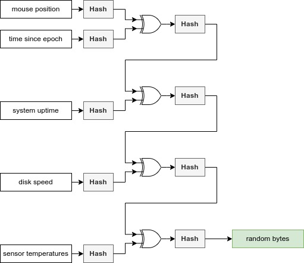

# pytrng

**A Python module to generate true random numbers.**

_pytrng_ is a true random number generator (TRNG) based on physical events. It uses
different inputs to generate a random bit array and does not need any special hardware.

> Do not use this package to generate numbers for encryption software!

## Input pool
The following input data is hashed (SHA1 to SHA512) and connected with XOR in a data pool:

* mouse position
* time since _epoch_
* system uptime
* disk speed (create and delete a temporary file)
* sensor temperatures

_XOR_ offers the security of the unbreakable One-Time-Pad (OTP).
Each input serves as a key for the next input. The result is the new key for the next
input and so on… That technically means that the result is the first input
encrypted by the other inputs multiple times. To increase the security, the connected data
is hashed.



## Installation and quickstart

> pytrng is currently under development. You can find it on [**TestPyPi**](https://test.pypi.org/project/pytrng/)
> and [**GitHub**](https://github.com/Gregor-Gottschewski/pytrng). I'm working to release it on the main Python Package Index in July.

You can install pytrng via pip:

    pip install -i https://test.pypi.org/simple/ --no-deps pytrng

To generate a 512-bit number initialize `pytrng` with `512` as a parameter (only `160`, `224`, `256`, `384` and `512` are
allowed):

```python
from pytrng import pytrng
trng = pytrng(512)
random_num = trng.generate_random()
print(random_num) # random_num as bytes
print(int.from_bytes(random_num, byteorder='big')) # random_num as int
```

You can receive raw data via the `DataCollector` class:
```python
from .pytrng import DataCollector
dc = DataCollector(256) # 256-bit output data
print("Mouse position: " + str(int.from_bytes(dc.get_mouse_position(), byteorder='big')))
print("Time since epoch: " + str(int.from_bytes(dc.get_time_since_epoch(), byteorder='big')))
print("System uptime: " + str(int.from_bytes(dc.get_sys_uptime(), byteorder='big')))
print("Disk speed: " + str(int.from_bytes(dc.get_disk_speed(), byteorder='big')))
print("Sensor temperatures: " + str(int.from_bytes(dc.get_sensors(), byteorder='big')))
```

## License
**MIT License**

> Copyright © 2023 Gregor Gottschewski
>
> Permission is hereby granted, free of charge, to any person obtaining a copy of this software and associated
> documentation files (the “Software”), to deal in the Software without restriction, including without limitation the
> rights to use, copy, modify, merge, publish, distribute, sublicense, and/or sell copies of the Software, and to permit
> persons to whom the Software is furnished to do so, subject to the following conditions:
>
> The above copyright notice and this permission notice shall be included in all copies or substantial portions of the
> Software.
>
> THE SOFTWARE IS PROVIDED “AS IS”, WITHOUT WARRANTY OF ANY KIND, EXPRESS OR IMPLIED, INCLUDING BUT NOT LIMITED TO THE
> WARRANTIES OF MERCHANTABILITY, FITNESS FOR A PARTICULAR PURPOSE AND NONINFRINGEMENT. IN NO EVENT SHALL THE AUTHORS
> OR COPYRIGHT HOLDERS BE LIABLE FOR ANY CLAIM, DAMAGES OR OTHER LIABILITY, WHETHER IN AN ACTION OF CONTRACT, TORT OR
> OTHERWISE, ARISING FROM, OUT OF OR IN CONNECTION WITH THE SOFTWARE OR THE USE OR OTHER DEALINGS IN THE SOFTWARE.