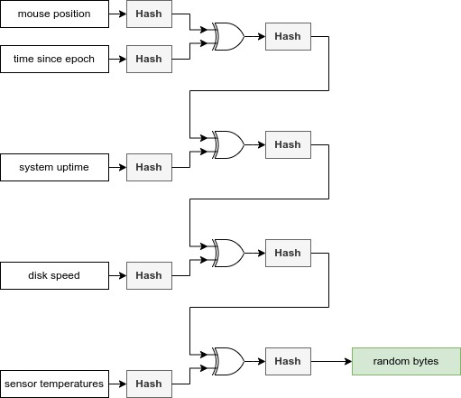

# pytrng


**A Python module to generate true random numbers.**

_pytrng_ contains a true random number generator (TRNG) and a pseudo random number generator (PRNG).
It uses multiple inputs to generate a random bit array.
No other external hardware is needed.

> Do not use the output of this package for real world encryption software!

## Input Pool
The following TRNG input data is hashed (SHA1 to SHA512) and connected with XOR:

* CPU jitter
* time since _epoch_
* system uptime
* disk speed (create and delete a temporary file multiple times)
* sensor temperatures

Every input is hashed and concatenated with the previous input.
This result is hashed again and concatenated with the next input.
When all inputs are hashed and concatenated, the result is hashed again used as output.

This model shows how that process works:



## Installation and quickstart

> pytrng is under development.
> You find it on [**TestPyPi**](https://test.pypi.org/project/pytrng/) and [**GitHub**](https://github.com/Gregor-Gottschewski/pytrng).

Install pytrng via pip:

    pip install -i https://test.pypi.org/simple/ --no-deps pytrng

Initialize `pytrng` with `512` as a parameter to generate a 512-bit number (only `160`, `224`, `256`, `384` or `512` is
allowed):

```python
from pytrng import pytrng

trng = pytrng(512)
random_num = trng.generate_random()
print(random_num) # random_num as bytes
print(int.from_bytes(random_num, byteorder='big')) # random_num as int
```

You receive raw data using the `DataCollector` class (TRNG-data):

```python
from pytrng import DataCollector

dc = DataCollector(256) # 256-bit output data
print("Mouse position: " + str(dc.get_mouse_position()))
print("Time since epoch: " + str(dc.get_time_since_epoch()))
print("System uptime: " + str(dc.get_sys_uptime()))
print("Disk speed: " + str(dc.get_disk_speed()))
print("Sensor temperatures: " + str(dc.get_sensors()))
```

You create your own `DataPool` to use custom input data:

```python
from src.pytrng import pytrng
from src.pytrng import DataPool
from src.pytrng import DataCollector

# custom data pool
dp = DataPool(512)

# collect data
dc = DataCollector(512)
dp.append(b'sh273w')            # a static custom value
dp.append(dc.get_sensors())     # DataCollector sensor data (only supported on linux)
dp.append(dc.get_sys_uptime())  # DataCollector system uptime

# generate random bytes
r = pytrng()
r.generate_random(dp)
```

## License

This project is licensed under the MIT License - see the [LICENSE](LICENSE) file for details.